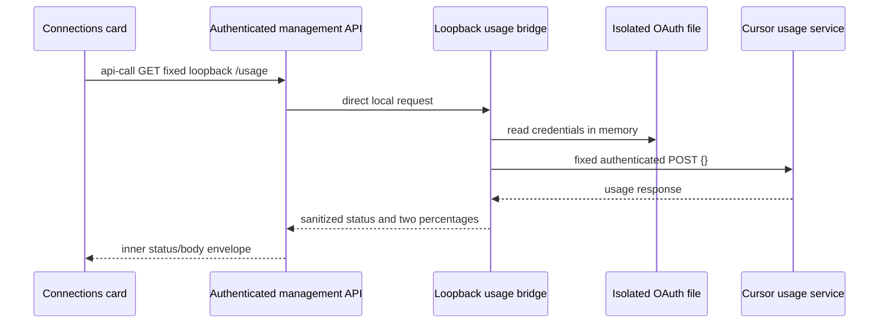

# Live Cursor Pro+ usage

## Goal Capsule

Show the authenticated Cursor account's two actual subscription usage pools in the Untitled Router Connections card, matching the supplied Cursor dashboard example. The user authorized investigation, implementation, live verification, and the LFG workflow. This plan governs implementation; the Product Contract takes precedence over technical choices. LFG owns simplification, review, browser testing, PR creation, and CI follow-through. Implementation returns to LFG before shipping. Do not merge the resulting PR automatically.

## Product Contract

### Summary and problem frame

The current Cursor card recognizes a configured OpenAI-compatible route but cannot display subscription remaining. Cursor's authenticated usage service returns two independent percentage fields. Show those actual values without confusing quota availability with inference health.

### Requirements

- **R1:** Show separate used-percentage bars for **Cursor Models** (Cursor Grok and Composer) and **Other Models**, including the two overflow explanations from the user's screenshot. Preserve Cursor's first position and the Codex-only meaning of existing filters and metrics.
- **R2:** Fetch live usage using the existing isolated Cursor service's authenticated account. Never place its access token, refresh token, email, account ID, raw responses, or credentials in browser state, logs, artifacts, or Git.
- **R3:** Show billing reset and last successful observation times. Distinguish loading, fresh, stale, expired authentication, and unavailable data. A route being configured or usage being readable does not prove inference health. Unknown usage must not appear as zero.
- **R4:** Keep usage independent of Codex refresh success. Clear account-specific data on logout, connection change, disabled route, or route mismatch. A delayed response from an earlier session must not populate a later session.
- **R5:** Support all four current locales, narrow screens, accessible labels, and bars whose semantics are percentage **used**. Preserve existing router, Codex, and Cursor inference configuration and billing settings.

### Acceptance examples

- **AE1 (R1):** Upstream `autoPercentUsed: 0.449166...` and `apiPercentUsed: 0.490909...` render approximately `0.45% used` and `0.49% used`, not 45% or a shared 8% spend-derived figure. Visual widths use the actual percentages.
- **AE2 (R2, R3):** An upstream 401 produces an authentication-required usage state, not a management-session logout or leaked upstream body.
- **AE3 (R3, R4):** A transient error can show a clearly stale snapshot for at most five minutes, never beyond the reported billing-cycle end. Replacing the credential or route clears the former account's snapshot.
- **AE4 (R4, R5):** Failed Cursor usage fetching leaves Codex cards usable. The two bars remain readable at mobile width and in each supported language.

### Scope

Read subscription usage only. No account enrollment, token refresh ownership, billing changes, inference probes, automatic spending controls, or quota estimates from router traffic. No new public network listener.

## Planning Contract

### Evidence

- Existing `docs/untitled/cursor-investigation.md` documents the main-to-isolated Cursor route. Live inspection confirmed the two services remain active and the isolated service owns the existing OAuth file.
- A read-only authenticated POST to `https://api2.cursor.sh/aiserver.v1.DashboardService/GetCurrentPeriodUsage` with `{}` returned HTTP 200, both percentages, and millisecond billing-cycle timestamps. No credential values were printed or persisted.
- [Cursor models and pricing](https://cursor.com/docs/models-and-pricing) describes the two pools. The [primary usage adapter](https://raw.githubusercontent.com/can1357/oh-my-pi/main/packages/ai/src/usage/cursor.ts) maps Cursor Models to `autoPercentUsed` and Other Models to `apiPercentUsed`. These are percent points, not fractions. The [endpoint documentation](https://raw.githubusercontent.com/cnwinds/cursor-pulse/master/docs/cursor-usage-api.md) describes the internal authenticated service.
- CLIProxyAPI v7.3.4's [management API implementation](https://raw.githubusercontent.com/router-for-me/CLIProxyAPI/v7.3.4/internal/api/handlers/management/api_tools.go) supports authenticated `/api-call`, an inner status/body envelope, and `proxy_url: direct`. This permits a loopback request without a new public API or changes to the router binary.
- Existing `src/services/api/apiCall.ts`, `src/services/api/devinQuota.ts`, and `src/features/untitled/useUntitledOverview.ts` establish request, normalization, cancellation, and polling patterns. No applicable Compound Packs or local solutions corpus were found.

### Key Technical Decisions

- **KTD1 (R2):** Add a Python standard-library bridge listening only on `127.0.0.1:18318`, pending a free-port check. A fixed GET `/usage` reads the isolated service's configured auth file and calls the fixed HTTPS upstream endpoint. No arbitrary URL, account selection, query parameters, token substitution, redirects, or write endpoints. Ignore proxy environment settings and use default verified TLS without custom CA or insecure overrides. Run as the existing isolated service user with read-only access. The Cursor plugin retains sole ownership of refresh and credential writes.
- **KTD2 (R1, R2, R4):** Browser requests use the existing authenticated main management `/api-call` with direct proxy mode, no auth index, and the fixed loopback URL. Normalize the inner response into a small versioned contract: status, nullable Cursor/Other percentages, observation time, and nullable cycle dates. Fetch only for an enabled `cursor-subscription` route whose base URL matches the existing loopback Cursor service. Do not attach one account's usage to an arbitrary similarly named provider.
- **KTD3 (R1, R3):** Use locale-aware percentage formatting with at most two decimals; avoid asserting Cursor's undocumented integer rounding rule. Reject negative, boolean, nonnumeric, or nonfinite percentages. Clamp only visual widths to 100, preserving a valid over-100 numeric readout. Never derive either pool from total spend divided by limit.
- **KTD4 (R2, R3):** Cache only the normalized sanitized contract in memory; never persist raw payloads or credentials. A credential-change fingerprint is one-way, memory-only, and never logged. Cache for 60 seconds with one in-flight upstream request, a bounded timeout and response-size limit, and a failure retry delay. Successful observation time remains the upstream fetch time. Invalidate on credential identity/content change, missing or disabled credentials, and authentication failure. Stale fallback is allowed only for transient failures, for five minutes maximum, and before cycle end. Do not serve old data while a changed credential fetch is in flight. Return only allowlisted fields and fixed error categories; disable raw request logging.
- **KTD5 (R3, R4, R5):** Integrate an independent usage state into overview refresh with existing abort/session-generation protections. Keep configuration status distinct from quota state. UI must expire stale data even when a tab resumes after polling was paused. Accessible progressbars explicitly report used percentage. Provide loading/error/stale translations in every locale.

### Architecture and lifecycle

```mermaid
stateDiagram-v2
  [*] --> Loading
  Loading --> Fresh: valid response
  Loading --> Unavailable: no usable response
  Fresh --> Stale: transient failure within age/cycle limits
  Stale --> Fresh: successful refresh
  Stale --> Unavailable: age or cycle expires
  Fresh --> AuthRequired: upstream authentication failure
  Stale --> AuthRequired: upstream authentication failure
  Fresh --> Loading: account or route changes; discard old data
```

### Assumptions, risks, and rollout

- One isolated Cursor account is associated with the existing loopback inference service. Supporting multiple Cursor accounts is outside scope.
- The individual usage endpoint is internal and may change. Isolate its schema mapping, treat malformed/partial fields as unavailable for that pool, and keep the rest of the dashboard operational.
- The bridge exposes sanitized quota information to local host processes; the existing authenticated management API is the remote authorization boundary. The host is treated as trusted and single-tenant; Host/Origin checks are not local authentication. Bind IPv4 loopback only, reject unrecognized Host/Origin headers as appropriate, omit CORS, and refuse redirects to prevent credential forwarding.
- Harden the systemd unit with no writable application paths, no privilege escalation, and no secrets in unit arguments or environment. Service installation must not broaden auth-file permissions.
- Deploy and verify the bridge before deploying the dashboard HTML. Back up the currently served artifact. Rollback restores the old HTML and stops/disables only the added bridge. Do not restart or reconfigure the two existing inference services unnecessarily.
- Live proof compares the sanitized upstream observations to the rendered card and confirms existing service health. It cannot guarantee future availability of Cursor's undocumented API.

## Implementation Units

### U1 — Read-only usage bridge and contract

**Goal:** Implement R2/R3 through KTD1/KTD3/KTD4. Depends on none.

**Files:** Create `server/cursor_usage.py`, `server/test_cursor_usage.py`, `deploy/untitled-cursor-usage.service`; document the normalized response contract in `docs/untitled/cursor-usage.md`.

**Approach:** Implement strict upstream normalization, bounded HTTPS transport without redirects, read-only credential loading, cache/single-flight/invalidation, sanitized errors, and fixed loopback HTTP handling. Keep pure normalization and injected clock/transport testable without real credentials.

**Test scenarios:** Valid two-pool values including zero and over-100; missing/invalid fields; malformed dates/body; upstream 401/403/429/5xx; timeout and oversized response; cache hit timestamp; concurrent calls; account changes during fetch; disabled/missing credential; stale expiry and billing rollover; unexpected route/method/query and redirect rejection; no secrets in responses or logs.

### U2 — Two-pool dashboard integration

**Goal:** Implement R1/R3/R4/R5 through KTD2/KTD3/KTD5. Depends on U1's response contract.

**Files:** Create `src/services/api/cursorUsage.ts` and focused tests; extend `src/services/api/apiCall.ts` with a typed optional direct-proxy field and test that the Cursor request sends `proxy_url: direct` without an auth index; update relevant files under `src/features/untitled/`, `src/components/untitled/`, the connections page/styles, and the existing four locale JSON files after locating their exact current paths. Extend existing refresh and Cursor-card tests.

**Approach:** Normalize the management inner envelope without logging out on inner 401. Independently fetch usage, guard session/route identity, and render two vertically stacked labeled bars matching the provided screenshot's grouping. Retain an honest unavailable fallback and explicit stale state, reset time, and last-updated time. Keep Codex counts and filters unchanged.

**Test scenarios:** AE1–AE4; independently missing pool; stale and auth-required states; route mismatch/disabled; session change and late response; timer/resume expiry; accessible used semantics; narrow layout and long translations.

### U3 — Deployment, live proof, and operator documentation

**Goal:** Complete R1–R5 with operational proof. Depends on U1/U2.

**Files:** Update `docs/untitled/cursor-usage.md` and appropriate deployment documentation; record review/browser evidence outside the shipped app.

**Approach:** Verify the proposed port is unused, install the hardened bridge using the existing service identity without exposing secrets, obtain sanitized live usage, build/deploy the management artifact with a rollback copy, and inspect the actual router page through computer use. Confirm both existing services remain active and no billing/config changes occurred. Document install, status checks, internal API limitation, credential ownership, and rollback.

**Test scenarios:** Live bridge and management proxy return matching sanitized pool values; browser shows both bars and timestamps; browser narrow width remains usable; unavailable bridge fails locally to the Cursor card; existing Codex cards remain functional. Avoid paid inference for quota validation.

## Verification Contract

- Bridge: `python3 -m unittest discover -s server -p 'test_*.py'`.
- Frontend: run focused Bun tests for new API normalization, overview refresh, and Cursor card using their actual repository test paths.
- Repository gate: `bun run verify` (required checks and full tests); inspect failures before expanding checks.
- Deployment: inspect systemd status for new bridge and both existing services; request only sanitized usage through the fixed bridge and authenticated management route. Never print auth files or tokens.
- Browser: LFG `ce-test-browser mode:pipeline` plus live computer-use inspection of the served Connections card at desktop and narrow width. Record exact observed usage values, timestamps, and visible status. Compare against sanitized upstream data collected near the same time.
- Review: LFG simplification and code review must cover the final branch diff; fix consequential findings before shipping. CI must pass or a real external blocker must be reported.

## Definition of Done

All five requirements and AE1–AE4 are covered; tests and repository verification pass; the live router displays the two actual pools with honest freshness; no secrets are committed or exposed; deployment and rollback are documented; review and browser evidence are recorded; an open PR contains the change, validation, and any material limitations, and its CI has been followed to a terminal state.
