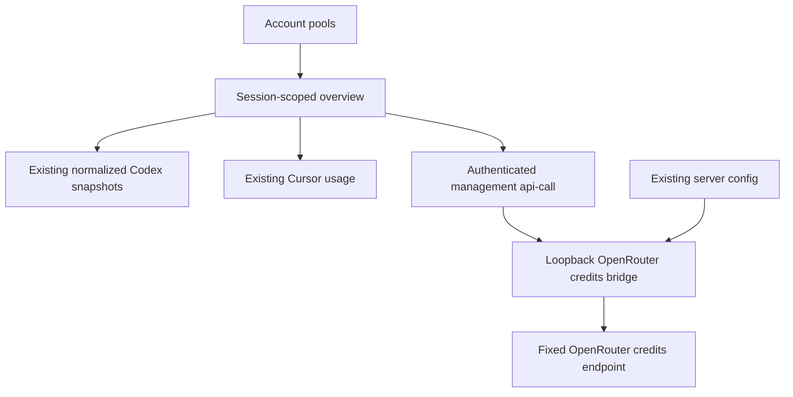
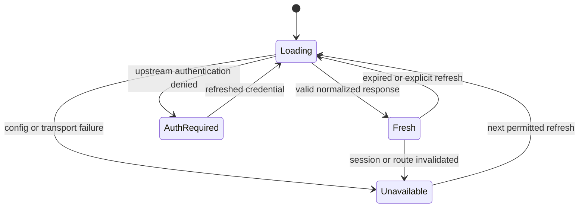

# Router Account Pools - Plan

## Goal Capsule

- **Objective:** Zach can see remaining Codex capacity, Cursor allowance, and OpenRouter money together before inspecting individual connections.
- **Means:** Three summary columns above Connections, reusing quota snapshots and adding a read-only credits bridge (KTD1–KTD3).
- **Authority:** The user’s recording and screenshot define the outcome; repository guidance and this plan govern implementation details.
- **Execution profile:** Bounded frontend and read-only service work with unit, browser, and live integration verification.
- **Stop conditions:** Stop for a credential boundary that cannot be preserved, a required upstream balance unavailable under the existing key, or a product contradiction that cannot be resolved from the recording.
- **Tail ownership:** The calling pipeline owns review, commits, open PR, and CI; this plan does not authorize merging the new PR.

---

## Product Contract

### Summary

Add an Account pools overview above Connections with Codex, Cursor, and OpenRouter columns, following the supplied dark three-column reference.

### Problem Frame

Individual connection cards make Zach inspect several places to determine remaining capacity, and the current dashboard does not expose the OpenRouter credit balance.

### Requirements

**Overview**

- R1. Display the three provider summaries above Connections, preserving existing account cards and filters.
- R2. Match the reference’s strong numeric hierarchy, provider accents, thin draining bars, and column separators; stack cleanly on narrow screens.

**Provider values**

- R3. Codex shows the sum of known weekly remaining percentages across configured accounts against 100% per account: three accounts expose a 300% denominator. Include valid reported quota even when an account is currently unavailable for routing; missing quota is visibly partial, never silently zero.
- R4. Cursor shows remaining Cursor Models allowance and a separate Other Models remaining reading using the existing usage source. Do not average the distinct pools or conflate their billing cycle with Codex’s weekly window.
- R5. OpenRouter displays dollars remaining from the actual account balance, with a draining bar whose denominator is total purchased credits; at zero balance the bar is empty.

**Data integrity**

- R6. Unknown, loading, disabled, authentication-required, and failed data remain distinct from a true zero. Refreshes and connection changes cannot display another session’s balances.
- R7. Provider credentials stay on the server and no new browser response, artifact, or log exposes keys or raw provider payloads.
- R9. Replace the Cursor connection card’s arrow with the official Cursor logo and each Codex connection card’s P/L/B letter with the OpenAI logo; use the same provider marks in pools with correct theme contrast.
- R10. Replace the top-left u. header mark with the user-supplied UC mark from `uc_stripe.jpg`, preserving the recognizable logo proportions and current navigation behavior.
- R8. Existing inference routing and provider configuration are unchanged; all new UI text, including accessible meter labels, is translated in all four locales.

### Acceptance Examples

- AE1. For three accounts reporting 99%, 99%, and 15% weekly remaining, Codex shows 213% of 300%; the bar fills 71% of its width. Covers R3.
- AE2. With one missing weekly reading, show the known sum as partial and the configured denominator; do not suggest complete capacity measurement. Covers R3, R6.
- AE3. Cursor reports 0.57 percentage points used and 0.49 other points used: show 99.43% and 99.51% remaining separately. Covers R4.
- AE4. OpenRouter reports total credits 100 and usage 23.50: show $76.50 with 76.5% fill. Usage 100 yields $0 and empty fill. Covers R5.
- AE5. A provider read fails or the operator changes management connections while a request is pending: unknown replaces unavailable values and the prior session’s result is discarded. Covers R6, R7.

### Scope Boundaries

No routing changes, new model aliases, budget controls, auto reload, subscriptions management, or fabricated active-request counts. Existing connection details remain available. Provider balance aggregation across multiple distinct OpenRouter accounts is outside this single configured-account feature.

### Sources

- User recording: [CLI Router Account View](https://supercut.ai/share/untitledcreative/1SpMblkTvex4ZGy3PbjeZT), retrieved by the caller with Supercut MCP.
- Attached CleanShot screenshot: dark Account pools layout with three provider columns.

---

## Planning Contract

### Key Technical Decisions

- KTD1. **Aggregate normalized snapshots in feature-owned pure logic.** Reuse `RouterAccountSnapshot.quota.weekly.remaining` from `src/services/api/untitled.ts`, which classifies weekly windows by duration. Account filtering must not change the overall pool. The denominator includes configured accounts; the known-sum display carries partial coverage when any account lacks quota. This directly implements R3 without duplicating provider parsing.
- KTD2. **Reuse Cursor usage and its expiration guards.** `useUntitledOverview` already owns fresh/stale lifecycle, independent refresh, route identity, cancellation, and session isolation. R4 is a display transformation: preserve fractional percentage points, show separate pools, and clamp remaining capacity to zero after exhaustion without inventing replenishment.
- KTD3. **Use a separate loopback credits bridge following the existing Cursor bridge.** The browser accesses a normalized credits response only through authenticated management `/api-call` with direct proxy mode. The service reads the existing main config under its existing service user and selects the single enabled OpenRouter provider with the exact official base URL and one usable key. Ambiguous configuration returns unavailable rather than selecting the first credential. This preserves R7; browser-side bearer headers and a broad proxy backend change are rejected.
- KTD4. **Use OpenRouter’s official credits endpoint.** `GET https://openrouter.ai/api/v1/credits` returns `data.total_credits` and `data.total_usage` with bearer auth, per [official documentation](https://openrouter.ai/docs/api/api-reference/credits/get-credits). Compute remaining as total minus usage; clamp the capacity display and bar at zero if exhausted, and preserve valid zero. Accept only finite nonnegative totals and usage, use USD formatting, and avoid division by zero. The bar represents remaining share of purchased credits, not the key’s optional spending limit.
- KTD5. **Fail closed with bounded refreshes.** The bridge returns exactly `version: 1`, `status: fresh | auth_required | unavailable`, `totalCredits`, `totalUsage`, `remainingCredits`, and `observedAtMs`. The four data fields are finite numbers on fresh responses and null on failures; the timestamp is epoch milliseconds. Fresh data may cache for 60 seconds; errors clear values rather than retaining stale monetary balances. Credential/config identity changes invalidate cache and in-flight results. Reuse the Cursor transport’s fixed destination, TLS verification, redirect refusal, size/time bounds, loopback Host/Origin checks, and no-store responses. Bridge latency must not hold up Codex or Cursor refresh.

### Assumptions

The recording’s Cursor column means both existing quota pools remain distinguishable, with Cursor Models visually primary. The screenshot is a visual reference rather than an instruction to show its Claude/Grok providers or nonexistent active-request telemetry. OpenRouter’s purchased-credit total is the only provider-reported denominator available for the requested draining balance bar.

### High-Level Technical Design

### System-Wide Impact and Risks

The new service is read-only and shares no inference listener. Its service user must already read the main config: do not broaden credential permissions or rewrite provider config. A YAML parser may be needed to consume the existing configuration; verify the deployed dependency, explicitly package it if necessary, and never parse YAML with regular expressions. Choose and verify a free loopback port during implementation and document it consistently in the unit and frontend. Management authentication remains the remote access boundary. Repeated API failures return resource-level statuses rather than logging out the management session.

No repository `docs/solutions/` learnings or configured packs were found. Applicable local patterns are `docs/untitled/cursor-usage.md`, `server/cursor_usage.py`, `src/features/untitled/useUntitledOverview.ts`, and `src/features/untitled/cursorIntegrationState.ts`.

---

## Implementation Units

### U1. Read OpenRouter credits without exposing credentials

**Goal:** Supply a normalized, authenticated, read-only balance source.

**Requirements:** R5–R8; KTD3–KTD5.

**Dependencies:** None.

**Files:** `server/openrouter_credits.py`, `server/test_openrouter_credits.py`, `deploy/untitled-openrouter-credits.service`, `docs/untitled/openrouter/README.md`.

**Approach:** Follow the Cursor bridge’s fixed upstream and service boundaries. Resolve one unambiguous enabled OpenRouter route from the existing configuration; return a minimal versioned response. Add bounded caching and credential/config identity invalidation. Document dependencies, safe installation, direct and management smoke checks, and rollback without changing inference services.

**Patterns to follow:** `server/cursor_usage.py`, `server/test_cursor_usage.py`, `deploy/untitled-cursor-usage.service`.

**Test scenarios:**

- Covers AE4: valid fractional, zero, and exhausted balances normalize correctly; zero purchased credits never divide by zero.
- Missing, malformed, nonfinite, negative, oversized, redirected, and timed-out responses produce unavailable without leaking payloads; captured responses and exception logs contain neither bearer tokens nor raw provider bodies (R7).
- Missing, disabled, ambiguous, changed, or unreadable config invalidates current data; in-flight old-key results cannot populate the new snapshot.
- Upstream 401/403 becomes auth-required; 429/5xx clears money data and obeys bounded retries.
- Host/Origin/path/method rejection and response-field allowlist preserve the local/remote boundary.
- Concurrent reads share an upstream request and cache expiry preserves the original observation timestamp.

**Verification:** Fake-transport Python tests pass; later live smoke proves the existing key can read credits through the exact management route and no inference configuration changed.

### U2. Integrate session-safe pool data

**Goal:** Expose independently refreshed OpenRouter credits and pure provider-pool display values.

**Requirements:** R3–R7; KTD1–KTD5.

**Dependencies:** U1 response contract.

**Files:** `src/services/api/openrouterCredits.ts`, `src/features/untitled/useUntitledOverview.ts`, `src/features/untitled/accountPools.ts`, `tests/openrouterCredits.test.ts`, `tests/accountPools.test.ts`, and focused lifecycle helpers/tests where needed.

**Approach:** Normalize through `apiCallApi`; keep raw field handling outside components. Bind credit snapshots to management session and configured provider identity. Preserve existing Cursor refresh ownership and ensure new failures cannot block other providers. Aggregate Codex before applying account-card filters and derive two separate Cursor remaining values.

**Patterns to follow:** `src/services/api/cursorUsage.ts`, `src/features/untitled/refreshCursorUsage.ts`, `src/features/untitled/watchCursorUsageExpiry.ts`, existing invalidation tests.

**Test scenarios:**

- Covers AE1–AE3: sum vs average, configured denominator, partial data, disabled account lacking quota, routing-unavailable account with quota, fractional Cursor values, and over-100 Cursor usage.
- Covers AE5: connection A/B/A changes, logout/login, route removal or credential change discard old responses and clear monetary snapshots.
- Inner auth failures stay resource-local; outer transport failures do not preserve expired balances.
- Codex/Cursor settle while OpenRouter is slow or unavailable; refresh deduplicates and expires data at the intended boundary.

**Verification:** Focused Bun tests prove calculations and lifecycle protection; existing Cursor/session suites remain green.

### U3. Render and verify the account-pools overview

**Goal:** Present accurate provider summaries in the requested visual arrangement.

**Requirements:** R1–R9.

**Dependencies:** U2.

**Files:** `src/features/untitled/AccountPools.tsx`, `src/features/untitled/UntitledDashboardPage.tsx`, `src/features/untitled/UntitledDashboardPage.module.scss`, `src/features/untitled/CursorIntegration.tsx`, existing `src/assets/icons/openai-dark.svg` and `src/assets/icons/openai-light.svg`, a bundled official Cursor SVG, all four `src/i18n/locales/` JSON files, `tests/accountPoolsRendering.test.ts`, and the OpenRouter deployment notes.

**Approach:** Insert a feature-owned section before Connections. Reuse existing OpenAI light/dark icons and bundle the official Cursor mark from https://cursor.com/marketing-static/favicon.svg (brand source https://cursor.com/brand); replace connection-card letter/arrow placeholders as required by R9. Use theme tokens, with distinct provider accents, large values, thin draining bars, separators, labels for quota basis, and explicit partial/unavailable states. Preserve connection filters and existing cards. Use accessible meter values with honest denominators and localized text.

**Test scenarios:**

- Static render proves correct labels/values, distinct Cursor pools, partial coverage, zero versus unavailable, and no fabricated active-request count.
- Connection cards and pool headers show the correct actual provider marks with light/dark contrast and decorative image semantics where the nearby text already names the provider.
- Desktop reference comparison verifies placement, column hierarchy, spacing, and provider colors; mobile at 390px stacks without overflow.
- Keyboard and screen-reader semantics expose meter name, current/max values, and unavailable status; light/dark themes remain readable.
- Live browser values agree with sanitized provider snapshots; a bridge-only outage affects only OpenRouter and recovery restores its value.
- Existing filters still affect only connection cards; refresh and route navigation remain functional without console errors.

**Verification:** Repository verification passes and a served single-file artifact works in the browser. Capture sanitized visual evidence before shipping.

### U4. Use the supplied UC header mark

**Goal:** Replace the placeholder workspace monogram with the supplied identity.

**Requirements:** R10.

**Dependencies:** U3.

**Files:** `src/features/untitled/UntitledLayout.tsx`, `src/features/untitled/UntitledLayout.module.scss`, and a bundled optimized UC image under `src/assets/`.

**Approach:** Use the user-supplied `uc_stripe.jpg` as authoritative artwork. Crop unused surrounding space if needed, preserve the logo’s aspect ratio, and bundle the optimized result so single-file deployment remains intact. Keep the existing home/navigation link and accessible name.

**Test expectation:** No new unit test for a static image replacement; verify actual appearance, dimensions, and link behavior in the browser.

**Verification:** Desktop/mobile header shows the supplied UC mark without distortion, clipping, or broken image; its existing link remains functional. Source image is a provided asset, not recreated typography.

---

## Verification Contract

- Run focused new Bun tests plus existing Cursor, quota, and session-isolation tests during implementation.
- Run `bun run verify` for tests, lint, TypeScript, and the production single-file build.
- Run `PYTHONDONTWRITEBYTECODE=1 python3 -m unittest discover -s server -p 'test_*.py'` for both bridges.
- Inspect the dashboard route in a browser at desktop and 390px, recording placement, accurate provider values, filter preservation, loading/error handling, and absence of unexpected console errors.
- Before deploying, validate the service unit and chosen port, preserve configuration ownership/mode, back up the current HTML, and retain a rollback path. Confirm loopback-only service access and remote unauthenticated management rejection.
- Compare live normalized balances against the displayed values without recording credentials. Verify existing routing services remain active and model catalogs remain available.

---

## Definition of Done

Each unit meets its specified behavioral and verification outcomes. The three summaries are visible above Connections with correct independent units, partial/error states, and responsive layout. Credentials remain server-side; the bridge is read-only and inference remains intact. Relevant automated and browser verification has passed, or a material blocker is explicitly reported. The reviewable diff includes the plan and operational notes, excludes generated artifacts and secrets, and removes abandoned experimental code. The pipeline receives verified work for its review and open-PR tail.
