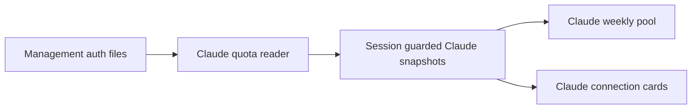

# Claude Code Overview Cards - Plan

## Goal Capsule
Objective: The router owner can see Claude Code subscription capacity and account usage on Overview alongside the existing providers.
Means: Reuse the quota reader already used by Manage (KTD1).
Authority: User request and repository guidance govern this plan. Stop for contradictory account contracts or unsafe deployment targets.
Execution: Bounded frontend change. LFG owns review and shipping after implementation returns.

## Product Contract
### Summary
Add a Claude Code account-pool display and a connection card for each Claude account, with the bundled Claude logo.
### Problem Frame
Manage already displays Claude limits, but Overview only loads Codex accounts and omits Claude capacity.
### Requirements
- R1. Account pools displays Claude Code weekly remaining capacity separately from Codex, with a Claude logo.
- R2. Connections displays each Claude account identity, plan when reported, status, usage windows and reset times, including model-specific windows reported by Manage.
- R3. Missing, disabled, failed, or invalid quota stays unavailable; zero remaining is a valid reading. Partial pools state their coverage.
- R4. Existing Codex counters, filters, routing summary, Cursor, and OpenRouter remain correct and independent of Claude data.
- R5. Both sections preserve the existing responsive design, accessible meters, localized copy, refresh cadence, and session isolation.
### Acceptance Examples
- AE1. A Claude account with five-hour utilization 5 and weekly utilization 1 shows 95% and 99% remaining; a reported Fable window is also visible. Covers R1, R2.
- AE2. A failed Claude quota request shows unavailable capacity without clearing healthy Codex data. Covers R3, R4.
### Scope Boundaries
No account provisioning, routing changes, new provider endpoints, or backend modifications.

## Planning Contract
### Key Technical Decisions
- KTD1. Reuse `src/features/quota/providers/claude/data.ts` for usage normalization and plan resolution, adding optional abort support if needed. No new API contract is introduced.
- KTD2. Keep Claude snapshots separate from Codex snapshots in the overview. Independent refresh completion prevents a slow provider from delaying another provider's display.
- KTD3. Pool only the general seven-day window; never combine model-specific weekly limits with general capacity. Follow existing summed-per-account capacity semantics and report missing readings.
- KTD4. Reuse `src/assets/icons/claude.svg`, existing card styles, and quota-meter rendering. Add all new text to the four locale files.
### Assumptions
A Claude pool should remain visible when no Claude account is available, with the existing no-accounts treatment. Codex plan filters continue to affect Codex cards only.
### High-Level Technical Design

### Operational Notes
The sibling backend checkout is absent. Reuse existing frontend contracts without changing endpoints or provider keys. Build remains a single HTML file. Before deployment, verify the live target, preserve the installed panel for rollback, and replace only the static panel. Browser automation has reported a missing Codex auth token; retry it and explicitly record any remaining live-verification limitation.

## Implementation Units
### U1. Load Claude overview snapshots
Goal: Make existing Claude quota data available to Overview.
Requirements: R2, R3, R4, R5; KTD1, KTD2.
Dependencies: None.
Files: `src/services/api/untitled.ts`, `src/features/quota/providers/claude/data.ts`, `src/features/untitled/useUntitledOverview.ts`, `src/features/untitled/refreshUntitledOverview.ts`, `tests/untitledOverviewRefresh.test.ts`, `tests/untitledClaude.test.ts`.
Approach: Add a separate Claude account loader using the existing provider reader and normalized auth-file metadata. Keep independent loading/error timestamps and apply the existing cancellation/session guards.
Test scenarios:
- Claude accounts use their auth index and the established usage reader.
- Disabled or missing-index accounts do not fetch quota.
- Usage failures preserve identity and mark quota unavailable; profile failure preserves valid windows.
- Slow or failed Claude requests do not delay Codex snapshots; aborted and obsolete responses cannot commit.
Verification: Focused API and coordinator tests prove these cases.

### U2. Render Claude pool and connection cards
Goal: Surface Claude capacity in both requested sections.
Requirements: R1-R5; AE1, AE2; KTD3, KTD4.
Dependencies: U1.
Files: `src/features/untitled/UntitledDashboardPage.tsx`, `src/features/untitled/AccountPoolsSection.tsx`, `src/features/untitled/accountPools.ts`, `src/features/untitled/ProviderMark.tsx`, associated SCSS modules, `src/i18n/locales/en.json`, `src/i18n/locales/zh-CN.json`, `src/i18n/locales/zh-TW.json`, `src/i18n/locales/ru.json`, `tests/untitledClaude.test.ts`, `tests/accountPools.test.ts`.
Approach: Add Claude branding, weekly pool computation, and connection cards using shared quota meters. Update section copy and responsive pool columns.
Test scenarios:
- Covers AE1. Correct remaining conversion and all provider-reported windows render with account identity.
- Covers AE2. Failed and missing quota renders unavailable, not full capacity.
- Multiple, partial, empty, and zero-capacity pools remain truthful.
- Codex filter/counters exclude Claude and retain their current behavior.
Verification: Regression tests, full repository verification, and desktop/narrow browser inspection of both sections.

## Verification Contract
Run `bun run verify` (tests, lint, TypeScript, production build). Run targeted Claude and overview tests during implementation. Inspect the actual deployed Overview in the Codex in-app browser if the connection is available. Compare Claude values with Manage after refresh and check desktop/narrow layout. If browser access remains unavailable, report it as unverified rather than asserting visual acceptance.

## Definition of Done
Both Claude displays use real provider data and bundled branding. Regression checks pass. Review fixes are committed and abandoned code removed. Deliver the single-file panel to the verified existing host with a rollback copy, and publish the scoped branch/PR under LFG. Report any remaining browser or deployment blocker explicitly.
